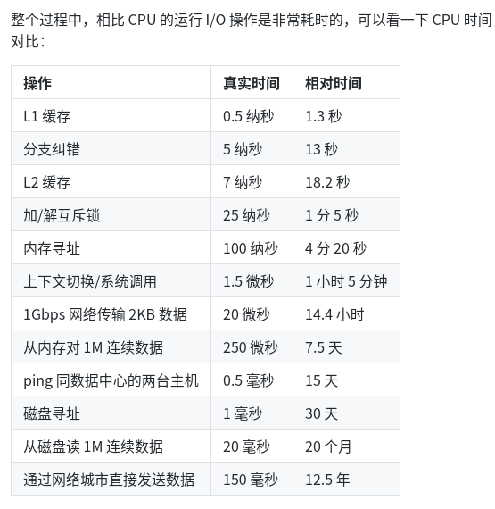

首先了解一下同步 (synchronous) 和异步 (asynchronous)，阻塞 (blocking) 和非阻塞 (non-blocking) 之间的区别。

同步意味着有序，多个程序之间协调一致，依次进行。
异步意味着无序，多个程序执行顺序不确定，也可以交替运行。
阻塞，一个程序在等待某个操作完成，自身停止运行，无法继续做其它任务，直到这个操作完成才继续运行。
非阻塞，一个程序在等待某个操作完成，自身不会停止运行，继续执行其它任务。

Liunx 下有五种 I/O 模型：
阻塞 I/O（blocking I/O）
非阻塞 I/O （nonblocking I/O）
I/O 复用（I/O multiplexing）
信号驱动 I/O （signal driven I/O (SIGIO)）
异步 I/O （asynchronous I/O）